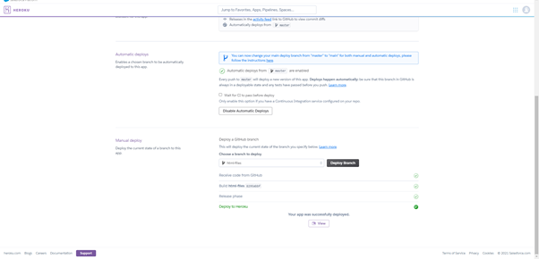

# Deployment

**Deployment on Heroku**

This project was developed using Gitpod, committed to git and pushed to Github using the built-in functionality.

It was then deployed to Heroku.

1. Create an account or log into [Heroku](https://www.heroku.com).
2. Navigate to Create New App within the New dropdown.
3. Enter App name and select a region

4. Reveal the Config Variables and enter the following information:
* IP
* SECRET_KEY
* PORT
* MONGO_DB (database name)
* MONGO_URI (taken from Mongo DB)

5. Connect using Github (if appropriate)

6. Select the branch for deployment

7. Deploy. The app can now be viewed live.

