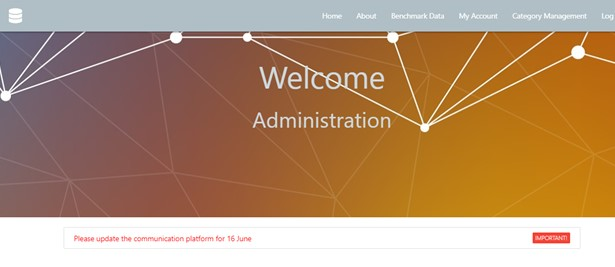

# Lead Generator Calculator

     IMAGE

[View the live site here](#)

# Contents

* [Project Overview](#project-overview)
* [User Experience Design](#user-experience-design)
   * [Strategy](#strategy)
   * [Scope](#scope)
   * [Structure](#structure)
   * [Skeleton](#skeleton)
   * [Surface](#surface)
* [Technologies Used](#technologies-used)
* [Testing](#testing)
* [Deployment](#deployment)
* [Credits](#credits)

<small><i><a href='http://ecotrust-canada.github.io/markdown-toc/'>Table of contents generated with markdown-toc</a></i></small>

# Project Overview

A site to assist people involved in strategic marketing decisions manage their core marketing campaign data and the subsequent number of leads generated to obtain information about the cost per lead. This data provides important insight into the value provided by individual marketing campaigns, which in turn allows for strategies and budgets to be based on real data.

Site users also have access to average cost per lead information from other companies using the site, providing a benchmark.

# User Experience Design

## Strategy

Developed for those involved in strategic marketing decisions, the site allows for better-informed decisions about marketing campaigns, based on the cost per marketing lead, and cost per converted sales lead per marketing activity / campaign.

Companies open an account and create a campaign profile, which includes the cost of the campaign, number of Marketing Qualified Leads (MQL), number of Sales Qualified Leads (SQL) and leads that converted into business. They are then presented with the cost per MQL and SQL, as well as a conversion hit rate to understand which activities provide the most converted leads as the best cost. This information gives the foundation for better-informed decisions for marketing strategies and budget planning.

Site users will have access to anonymous comparable data, so they have a benchmark.

The site is free-to-use and mobile responsive.

### Target audience

Small-Medium Enterprises (SMEs) that are unlikely to have a Customer Relationship Management (CRM) tool, or are relying on spreadsheets to manage this information. The site will be a source of information that can be updated as a campaign continues to run and then presented to stakeholders as needed.

Campaigns can be created, read, edited, and deleted by the account owner, following the CRUD basic operations of persistent storage. 

### User stories

**First-time visitors**

    a. As a first-time visitor I want to quickly understand the purpose of the site
    b. As a first-time visitor I want to easily register an account
    c. As a first-time visitor I want to feel confident that the data I enter is secure
    d. As a first-time visitor I want to understand any cost associated with registration
    e. As a first-time visitor I want to quickly create a new campaign 
    f. As a first-time visitor I want to easily obtain comparative benchmark data

**Returning visitors**

    a. As a returning visitor I want to quickly and easily log into my account profile
    b. As a returning visitor I want to see all open / live and closed campaigns
    c. As a returning visitor I want to quickly create a new campaign
    d. As a returning visitor I want to read existing campaign data
    e. As a returning visitor I want to easily update existing campaign and / or account profile data
    f. As a returning visitor I want to delete campaign information with confidence

**Site administrator**

    a. As a site administrator I want to quickly and easily log into the admin area
    b. As a site administrator I want to create a new industry / communications platform category
    c. As a site administrator I want to read information about existing categories
    d. As a site administrator I want to easily update existing category information
    e. As a site administrator I want to delete category information with ease

## Scope

### Features

| Feature  | Details  | Internal Links |
|---|---|---|
| Nav bar | Consistent on each file using Jinga templating | Home - About - Benchmark data - Log In - Sign Up |
| Favicon | Consistent on each file using Jinga templating | Home |
| Footer | Consistent on each file using Jinga templating. Copyright info | N/A |
| Contact form | Pop-up form accessible at the bottom of every page. Floating action button. | N/A |
| About | General site info and FAQs | Log In / Sign Up links |
| Benchmark Data | Graphs to display data from companies using the site, including helpful links from external sources about lead generation and cost | Log In / Sign up links |
| Log In page | Email address and password required. Also used for Admin log in  | Sign up page link |
| Sign Up page | Email address and password only required  | Log in page link |
| Administration profile | Category management: create, read, edit and delete | Create new category or edit existing category link |
| Create a new category | Save new category listing  | N/A |
| Account profile | Campaign management: create, read, edit and delete | Create new campaign or edit existing category link |
| Create a new campaign | Save new category listing listing  | N/A |

**Future features**

1. Currency exchange: For comparison purposes, data displayed on benchmark-data.html will be converted into Euros using an API. It will therefore be converted in the back-end before displayed in the front-end

**Site warnings**

Warnings within the account.html file have been included to encourage site users enter the information required to ensure data displays correctly on the graphs within benchmark_data.html.

Example 1

    

When an user signs into the site they are only requested to input an email address and password to ensure minimal information is requried on initial set up. The user is then encouraged to update their information, in particular industry as this is required for benchmark data. This warning remains until the user has selected an industry.

Example 2

    

Campaigns need campaign type and communication platform: the above warning is a link to the campaign that needs updating. This ensures that if a campaign type or communication platform is not available, the
user knows to update it.

## Structure

### Site map

## Skeleton

For wireframes see separate [SKELETON.md file](SKELETON.md).

**Database schema**

The database schema was created using [Creately](https://creately.com/) to generate a database schema. 

Industry and country are dropdown fields to reduce the risk of misspellings - this data is required to populate graphs displayed on benchmark-data.html, so the input must be uniformed, rather than free-text. The Industry listing will be managed by Administration who will have access to create, edit and delete the industry options.

Calculations were input into a separate collection, to allow for data to be further manipulated and displayed in the graph on benchmark-data.html.

## Surface

### Template

The site uses the [Parallax template](https://materializecss.com/templates/parallax-template/preview.html) from Materialize (https://materializecss.com), which has been heavily modified.

### Typography

Font families used are: Segoe UI, Roboto, Oxygen-Sans, Ubuntu, Cantarell, Helvetica Neue, sans-serif as set by the Materialize template.

### Color scheme

Based on the blue-grey color scheme, with a combination of blue-grey lighten and white text, as supplied by [Materlialize](https://materializecss.com/color.html).

### Imagery

**Background Image 1**

    

Image by <a href="https://pixabay.com/illustrations/cyber-network-technology-futuristic-3400789/">The Digital Artist</a> from <a href="https://pixabay.com/?utm_source=link-attribution&amp;utm_medium=referral&amp;utm_campaign=image&amp;utm_content=3400789">Pixabay</a>

**Background Image 2**

    

Image by <a href="https://pixabay.com/photos/smart-city-communication-network-4168483/">Tumisu</a> from <a href="https://pixabay.com/?utm_source=link-attribution&amp;utm_medium=referral&amp;utm_campaign=image&amp;utm_content=4168483">Pixabay</a>

**Background Image 3**

    

Image by <a href="https://pixabay.com/illustrations/background-abstract-line-2462436/">Денис Марчук</a> from <a href="https://pixabay.com/illustrations/background-abstract-line-2462436/Image">Pixabay</a>

**Background Image 4**

    

Image by <a href="https://pixabay.com/illustrations/mobile-phone-smartphone-app-1087845/">Gerd Altmann</a> from <a href="https://pixabay.com/?utm_source=link-attribution&amp;utm_medium=referral&amp;utm_campaign=image&amp;utm_content=1087845">Pixabay</a>

# Technologies Used

The project uses the following languages;

* HTML5
* CSS
* JavaScript
* jQuery
* Python

The project was created on GitHub and uses the following libraries and frameworks:

 - [Balsamiq](https://balsamiq.cloud/) - used to create all wireframes
 - [Materialize](https://materializecss.com/about.html) - the site layout uses the Parallax template from Materialize, which has been heavily modified
 - [Google Fonts](https://fonts.google.com/specimen/Permanent+Marker?preview.text=Gothenburg%20Netball%20Club%20Est.%202019%20Fun,%20fitness%20and%20friendship!&preview.text_type=custom) - Permanent Marker and Lato
 - [MongoDB](https://www.mongodb.com/) - used for the database management, and charts on benchmark_data.html
 - [Heroku]()
 - [Creately]
 - [PEP 8](https://www.python.org/dev/peps/pep-0008/#indentation) - help following PEP 8 styling guidelines
 - **[Free Formatter HTML](https://www.freeformatter.com/html-formatter.html) - for HTML code formatting
 - **[Free Formatter CSS](https://www.freeformatter.com/css-beautifier.html) - to beautify CSS code
 - [Grammarly](https://app.grammarly.com/) [(Example)](supporting-docs/grammarly-example.jpg) - the free service to double check grammar and spelling 
 - [Monday.com](https://view.monday.com/1287064588-3df266aa3259485edf2c68ed782207b8?r=use1) - used for project/task management 
 - **[Am I responsive](http://ami.responsivedesign.is/) - supplied the responsive image for the top of README.md

# Testing

[See separate Testing file](TESTING.md) for information on testing and issues.

# Deployment

**Conection to MongoDB**

The Github repo is connected to MongoDB:

**Deployment on Heroku**

# Credits

* [Geeks for Geeks: help with count_document calculation](https://www.geeksforgeeks.org/count-the-number-of-documents-in-mongodb-using-python/); [help with update_many](https://www.geeksforgeeks.org/mongodb-update-multiple-documents-using-mongoshell/?ref=rp)
* [Stackoverflow](http://stackoverflow.com) - general help including PyMongo, MongoDB and [numbers only input field](https://stackoverflow.com/questions/8808590/number-input-type-that-takes-only-integers); [reverse Jinja template order](https://stackoverflow.com/questions/12680691/loop-backwards-using-django-template/12680719); [error handling for calculation](https://stackoverflow.com/questions/1841565/valueerror-invalid-literal-for-int-with-base-10)
* [Analytics Vidhya - help with pymongo aggregation](https://www.analyticsvidhya.com/blog/2020/08/how-to-create-aggregation-pipelines-in-a-mongodb-database-using-pymongo/)
* [Yawin Tutor - help with handling 0 in calculate_results function](https://www.yawintutor.com/zerodivisionerror-division-by-zero/)
* Code Institute Slack community
* Narender Singh, Code Institute mentor
* Code Institute tutors
* Ex-colleagues for supporting me and helping test the site
