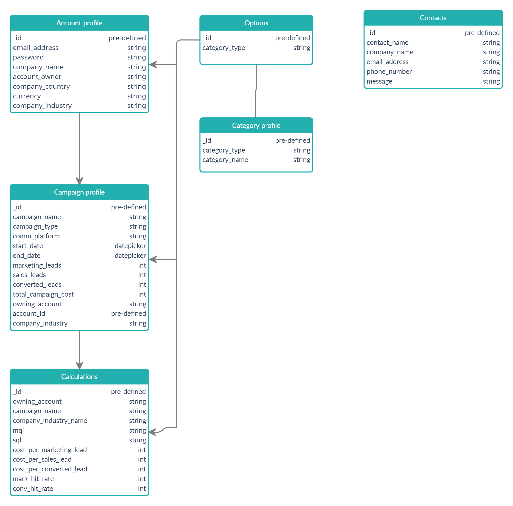

# Lead Generator Calculator

    

<a href="https://lead-generation-calculator.herokuapp.com/index" target="_blank">View the live site here</a>

# Contents

* [Project Overview](#project-overview)
* [User Experience Design](#user-experience-design)
   * [Strategy](#strategy)
   * [Scope](#scope)
   * [Structure](#structure)
   * [Skeleton](#skeleton)
   * [Surface](#surface)
* [Technologies Used](#technologies-used)
* [Testing](#testing)
* [Deployment](#deployment)
* [Credits](#credits)

<small><i><a href='http://ecotrust-canada.github.io/markdown-toc/'>Table of contents generated with markdown-toc</a></i></small>

# Project Overview

A site to assist small business owners, and/or those involved in strategic marketing decisions to manage data from leads generated by their marketing campaigns/activities. The number of leads generated and converted, and the related cost per lead provides important insight into the value provided by individual marketing campaigns, which in turn allows for strategies and budgets to be based on real data.

Site users also have access to the average cost per lead information from other companies using the site, providing a benchmark.

# User Experience Design

## Strategy

Developed for those involved in strategic marketing decisions at mainly Small-Medium Enterprises (SMEs), the site allows for better-informed decisions about marketing campaigns, based on the cost per marketing lead, cost per sales lead, and cost per converted lead, per marketing activity/campaign.

Companies open an account and create campaign profiles, which include the cost of the campaign, number of Marketing Qualified Leads (MQL), number of Sales Qualified Leads (SQL), and the number of leads that have converted into business. They are then presented with the cost per MQL and SQL, as well as a conversion hit rate from marketing to sales lead. This helps them to understand which activities provide the most converted leads, at the best cost. This information helps create the foundation for better-informed decisions for marketing strategies and budget planning.

Site users have access to anonymous comparable data, so they have a benchmark. This information is taken from the accounts using the site.

The site is free-to-use and mobile responsive.

### Target audience

Small-Medium Enterprises (SMEs) that are unlikely to have a Customer Relationship Management (CRM) tool (such as <a href="https://www.salesforce.com/se/?ir=1" target="_blank">Salesforce</a> or <a href="https://dynamics.microsoft.com/sv-se/" target="_blank">MS Dynamics</a>), or are relying on spreadsheets to manage this information. The site will be a source of information that can be updated as a campaign continues to run and then presented to stakeholders as needed.

Campaigns can be created, read, edited, and deleted by the account owner, following the CRUD basic operations of persistent storage. 

### User stories

**First-time visitors**

a. As a first-time visitor I want to quickly understand the purpose of the site
b. As a first-time visitor I want to easily register an account
c. As a first-time visitor I want to feel confident that the data I enter is secure
d. As a first-time visitor I want to understand any cost associated with registration
e. As a first-time visitor I want to quickly create a new campaign 
f. As a first-time visitor I want to easily obtain comparative benchmark data

**Returning visitors**

a. As a returning visitor I want to quickly and easily log into my account profile
b. As a returning visitor I want to see all open campaigns
c. As a returning visitor I want to quickly create a new campaign
d. As a returning visitor I want to read existing campaign data
e. As a returning visitor I want to easily update existing campaign and/or the account profile information
f. As a returning visitor I want to delete campaign information with confidence

**Site administrator**

a. As a site administrator I want to quickly and easily log into the admin area
b. As a site administrator I want to create a new industry, communications platform, or campaign type category
c. As a site administrator I want to read information about existing categories
d. As a site administrator I want to easily update existing category information
e. As a site administrator I want to delete category information
f. As a site administrator I want to create, edit and delete campaigns, the same as a "normal" user

## Scope

### Features

| Feature  | Details  | Internal Links |
|---|---|---|
| Nav bar | Consistent on each file using Jinga templating | Home - About - Benchmark data - Log In - Sign Up - (Log out for when users are logged in and Manage Categories when admin are logged in)|
| Favicon | Consistent on each file using Jinga templating | Home |
| Footer | Consistent on each file using Jinga templating. Copyright info | N/A |
| Contact form | Pop-up form accessible at the bottom of every page. Floating action button. | Benchmark data - My Account (if logged in) or Log In - Contact form |
| About | General site info and FAQs | Log In / Sign Up links |
| Benchmark Data | Graphs to display data from companies using the site | Log In / Sign up links |
| Log In page | Email address and password required. Also used for Admin log in  | Sign up page link |
| Sign Up page | Email address and password only required  | Log in page link |
| Administration profile | Category management: create, read, edit and delete | Create a new category or edit existing category link |
| Create a new category | Save new category listing  | N/A |
| Account profile | Campaign and account management: create, read, edit and delete campaigns and edit account info or delete the account | Create new campaign or edit existing category link |
| Create a new campaign | Save new category listing  | N/A |

**Future features**

1. Currency exchange: In the future, users will be able to enter information in currency other than Euros. For comparison purposes, the financial data will be converted into Euros using an API.
2. Country dropdown connected to currency: A dropdown selection connecting the selected country to the relevant currency, which is then connected to a currency converter.
3. More in-depth comparison data based on campaign type and communication platform, not just industry. For the basic purposes of the site, the industry is more relevant as a benchmark. Comparing another company based purely on the communication platform does not give a clear picture, there are many other factors to consider. 
4. Active contact us form: managed by admin

**Site warnings**

Warnings within the account.html file have been included to ensure site users enter the information required to ensure data displays correctly on the graphs within benchmark_data.html.

Example 1

    

When a user signs up for an account they are only requested to input an email address and password; entering this minimal information ensures initial registration is required simple and quick. 

The user is required to update the industry field before creating a campaign, as this is required for benchmark data. This warning remains until the user has selected an industry. Other information does not need to be updated.

Example 2

    

Campaigns need campaign type and communication platform: the above warning is a link to the campaign that needs updating. This ensures that if a campaign type or communication platform is not available, the
user knows to update that campaign.

## Structure

### Site map

## Skeleton

For wireframes see separate [SKELETON.md file](SKELETON.md).

**Database schema**

The database schema was created using [Creately](https://creately.com/). 

Collections

* Contacts

Contains all contact messages sent to the site. In the future this will be accessed by Administration, with the ability to follow a communication thread, mark as read, and connect to an account if one exists. At present contains basic information from the user, which administration can access through Mongo DB.

* Options

Industry, Communication Platform and Campaign Type: this is to ensure that administration does not create new categories which the user cannot access, or that they create new ones using free text, which risk spelling mistakes, rendering them unusable by the site user.

* Categories

Connects to options. This collection contains the industry, communication platform and campaign type as created, edited and deleted by administration. The category id for industry is connected to the calculations collection, to enable Mongo DB to create graphs based on the industry and a sum of all calculations in the collection.

They are also connected to the campaign collection, so should administration edit a category, this is reflected in the users' campaigns.

* Accounts

Basic account information, all, excluding the currency field and password, of which can be edited by the owning account. Administration cannot edit the email address for security reasons.

Industry field is dropdown to reduce the risk of misspellings - this data is required to populate graphs displayed on benchmark-data.html, so the input must be uniform, not free-text. The Industry listing is managed by Administration who have access to create, edit and delete the industry options, in addition to campaign type and communication platform.

Country field in the account profile is a dropdown connected to [REST Countries API](https://restcountries.eu/rest/v2/all) and saved in Mongo DB. In the future, this will link to a currency selector, which will then connect to a currency convertor. As graphs are based on financials in the system, the only option at present is Euros.

* Campaigns

Basic information about the campaign, including name, start date and dropdown options for campaign type and communication platform. This is connected to the accounts collection using the id.

* Calculations

Connected to campaigns, all calculations are managed in an individual collection for ease regarding generating graphs for the comparative data.

## Surface

### Template

The site uses the [Parallax template](https://materializecss.com/templates/parallax-template/preview.html) from Materialize (https://materializecss.com), which has been heavily modified.

### Typography

Font families used: Segoe UI, Roboto, Oxygen-Sans, Ubuntu, Cantarell, Helvetica Neue, sans-serif as set by the Materialize template.

### Color scheme

Based on the blue-grey color scheme, with a combination of blue-grey lighten and white text, as supplied by [Materlialize](https://materializecss.com/color.html).

### Imagery

**Background Image 1**

    

Image by <a href="https://pixabay.com/illustrations/cyber-network-technology-futuristic-3400789/">The Digital Artist</a> from <a href="https://pixabay.com/?utm_source=link-attribution&amp;utm_medium=referral&amp;utm_campaign=image&amp;utm_content=3400789">Pixabay</a>

**Background Image 2**

    

Image by <a href="https://pixabay.com/photos/smart-city-communication-network-4168483/">Tumisu</a> from <a href="https://pixabay.com/?utm_source=link-attribution&amp;utm_medium=referral&amp;utm_campaign=image&amp;utm_content=4168483">Pixabay</a>

**Background Image 3**

    

Image by <a href="https://pixabay.com/illustrations/background-abstract-line-2462436/">Денис Марчук</a> from <a href="https://pixabay.com/illustrations/background-abstract-line-2462436/Image">Pixabay</a>

**Background Image 4**

    

Image by <a href="https://pixabay.com/illustrations/mobile-phone-smartphone-app-1087845/">Gerd Altmann</a> from <a href="https://pixabay.com/?utm_source=link-attribution&amp;utm_medium=referral&amp;utm_campaign=image&amp;utm_content=1087845">Pixabay</a>

# Technologies Used

The project uses the following languages;

* HTML5
* CSS
* JavaScript
* jQuery
* Python

The project was created on GitHub and uses the following libraries and frameworks:

 - [Balsamiq](https://balsamiq.cloud/) - used to create all wireframes
 - [Materialize](https://materializecss.com/about.html) - the site layout uses the Parallax template from Materialize, which has been heavily modified
 - [Google Fonts](https://fonts.google.com/) - Segoe UI, Roboto, Oxygen-Sans, Ubuntu, Cantarell, Helvetica Neue, sans-serif
 - [MongoDB](https://www.mongodb.com/) - used for the database management, and charts on benchmark_data.html
 - [REST Countries API](https://restcountries.eu/rest/v2/all) - API used for the country dropdown in account profile
 - [Heroku](https://id.heroku.com/login) - for site deployment
 - [Creately](https://creately.com/) - used to generate the database schema layout
 - [PEP 8](https://www.python.org/dev/peps/pep-0008/#indentation) - help following PEP 8 styling guidelines
 - [Free Formatter HTML](https://www.freeformatter.com/html-formatter.html) - for HTML code formatting
 - [Free Formatter CSS](https://www.freeformatter.com/css-beautifier.html) - to beautify CSS code
 - [Code Beautify](https://codebeautify.org/python-formatter-beautifier) - help with line indentation in Python
 - [Grammarly](https://app.grammarly.com/) [(Example)](supporting_docs/grammarly_example.jpg) - the free service to double check grammar and spelling 
 - [Monday.com](https://view.monday.com/1287064588-3df266aa3259485edf2c68ed782207b8?r=use1) - used for project/task management 
 - [Am I responsive](http://ami.responsivedesign.is/) - supplied the responsive image for the top of README.md
 - [Remove BG](https://www.remove.bg/) - remove background from Am I Responsive image

# Testing

[See separate Testing file](TESTING.md) for information on testing and issues.

# Deployment

[See separate Deployment file](DEPLOYMENT.md) for information about site deployment using Heroku.

**How to fork the GitHub Repository**

Forking the repository allows you to make a copy of the original in your GitHub account, and make changes without affecting the original.

1. Log onto Github.
2. From the list of repositories, select CatherineTrevor/lead-generator-calculator.
3. At the top of the repository, select the "Fork" button.
4. This should create a copy within your account.

**How to run this project locally**

1. Log onto Github: create an account if required.
2. From the list of repositories, select CatherineTrevor/lead-generator-calculator.
3. Click the "Code" dropdown within the menu above the commits.
4. Copy the URL address, or Download ZIP and save locally.
5. Open your chosen IDE and navigate to the location you want the cloned directory to be saved.
6. Type git clone and copy the URL within the CLI and press enter.
7. Alternatively, select "Open with Github Desktop".

# Credits

* [Geeks for Geeks: help with count_document calculation](https://www.geeksforgeeks.org/count-the-number-of-documents-in-mongodb-using-python/); [help with update_many](https://www.geeksforgeeks.org/mongodb-update-multiple-documents-using-mongoshell/?ref=rp)
* [Stackoverflow](http://stackoverflow.com) - general help including PyMongo, MongoDB and [numbers only input field](https://stackoverflow.com/questions/8808590/number-input-type-that-takes-only-integers); [reverse Jinja template order](https://stackoverflow.com/questions/12680691/loop-backwards-using-django-template/12680719); [error handling for calculation](https://stackoverflow.com/questions/1841565/valueerror-invalid-literal-for-int-with-base-10); [date range input](https://stackoverflow.com/questions/33405418/first-date-field-should-not-be-greater-than-second-date-field-value-using-jquery); [error handling](https://stackoverflow.com/questions/14993318/catching-a-500-server-error-in-flask)
* [Analytics Vidhya - help with pymongo aggregation](https://www.analyticsvidhya.com/blog/2020/08/how-to-create-aggregation-pipelines-in-a-mongodb-database-using-pymongo/)
* [Yawin Tutor - help with handling 0 in calculate_results function](https://www.yawintutor.com/zerodivisionerror-division-by-zero/)
* [Table to Markdown](https://tabletomarkdown.com/convert-spreadsheet-to-markdown/) - convert excel testing file into markdown table for TESTING.md
* [Code Pen](https://codepen.io/nikitahl/pen/PVVrYg) - country dropdown code copied and modified
* [Mongo DB Docs](https://docs.mongodb.com/guides/) - general help and research
* [W3 Schools](https://www.w3schools.com/python/default.asp) - general help and research
* Code Institute Slack community
* Narender Singh, Code Institute mentor for his time, support and guidance
* Code Institute tutors for their time and help
* Ex-colleagues, friends and family for their support and time testing the site
