# Testing

Testing was done throughout site development, with branches created for each feature before it was merged into the master file. 

Usability was tested with the below workflow, sent to new users to ensure testing from different users, on different devices and browsers to ensure issues were caught and fixed during development.

|         | User Action                                                                              | Expected result                                                                                                                                                                       | Y/N |
| ------- | ---------------------------------------------------------------------------------------- | ------------------------------------------------------------------------------------------------------------------------------------------------------------------------------------- | --- |
|  | Sign Up
| 1       | Click on Sign-up from navbar                                                             | Blank sign-up page                                                                                                                                                                    | Y   |
| 2       | Enter new username                                                                       | Field will only accept email address format                                                                                                                                           | Y   |
| 3       | Enter new password                                                                       | Field will only accept min 8 characters: 1 upper, 1 lower, 1 number at least                                                                                                          | Y   |
| 4       | Click create account                                                                     | \* Opens account page with "Welcome" at the top \* ADMIN: a new account has been created in MongoDB                                                                | Y   |
| 5       | Campaign overview table                                                                  | All 0 or blank                                                                                                                                                                        | Y   |
| 6       | Action: edit account info                                                                | \* Update information \* Currency is read only                                                                                                                                     | Y   |
| 7       | Select save                                                                              | Account information is updated                                                                                                                                                         | Y   |
| 8       | Action: create new campaign                                                              | Opens blank Campaign Profile page                                                                                                                                                     | Y   |
| 9       | Fill in fields                                                                           | Campaign name, campaign type, communication platform and start date are all required fields. End date cannot be before start date                                                                                           | Y   |
| 10      | Click save                                                                               | \* Back to account page with the added campaign. \* Campaign overview now updated with relevant data. \* ADMIN: a new campaign and calculation have been created within MongoDB | Y   |
| 11      | Open campaign dropdown                                                                   | \* Contains the info you input \* Are the calculations correct?                                                                                                                    | Y   |
| 12      | Click edit icon                                                                          | \* Takes you to Update Campaign Profile page \* Does it display the information you previously entered?                                                                            | Y   |
| 13      | Update campaign profile and select save & close                                          | \* Takes you back to the account page \* Has the campaign information and campaign overview table been updated with the new information?                                           | Y   |
| 14      | Action: create new campaign                                                              | Opens blank Campaign Profile page                                                                                                                                                     | Y   |
| 15      | Action: create a campaign with the same name as an existing campaign, (not case sensitive)        | Does not allow you to create a campaign                                                                                                                                               | Y   |
| 16      | Fill in fields                                                                           | Campaign name, campaign type, communication platform and start date are all required fields                                                                                           | Y   |
| 17      | Click save                                                                               | \* Back to account page with the added campaign. \* Campaign overview now updated with relevant data.                                                                              | Y   |
| 18      | Action: create new campaign                                                              | Opens blank Campaign Profile page                                                                                                                                                     | Y   |
| 19      | Click cancel                                                                             | Back to account page without an added campaign                                                                                                                                        | Y   |
| 20      | Open a campaign dropdown and select delete icon                                          | Pop-up: are you sure you want to delete "campaign name"                                                                                                                               | Y   |
| 21      | Select "No"                                                                              | Back to account profile page                                                                                                                                                          | Y   |
| 22      | Open a campaign dropdown and select delete icon                                          | Pop-up: are you sure you want to delete "campaign name"                                                                                                                               | Y   |
| 23      | Select "Yes"                                                                             | Deletes campaign and updates account overview table                                                                                                                                   | Y   |
| 24      | Action: looking for comparative data                                                     | Redirects to Benchmark data page and table                                                                                                                                            | Y   |
| 25      | Navigate back to My Account                                                              |                                                                                                                                                                                       | Y   |
| 26      | Create a new campaign with a very high total campaign cost to create a very high average |                                                                                                                                                                                       | Y   |
| 27      | Navigate back to Benchmark data                                                          | Is your additional data represented in the graphs?                                                                                                                                    | Y   |
| 28      | Click "Log out" in the top navigation                                                    | \* Redirects you to Log in page \* Navbar no longer says "My Account" but rather Log in and Sign up                                                                                | Y   |
| 29      | Click browser back button                                                                | You are still logged out                                                                                                                                                              | Y   |
|   | Log In
| 1        | Navigate to Log In page                                                                  | Blank log in page                                                                                                                                                                     | Y   |
| 2       | Log In using your existing username and password                                         | Redirects you to account profile page with all pre-entered campaigns and information                                                                                              | Y   |
| 3       | Click "Log out" in the top navigation                                                    | \* Redirects you to Log in page \* Navbar no longer says "My Account" but rather Log in and Sign up                                                                                | Y   |
|  | Sign Up
| 1       | Click on Sign-up from navbar                                                             | Blank sign-up page                                                                                                                                                                    | Y   |
| 2       | Sign up using the same email address as before                                           | Should not allow you to create an account                                                                                                                                             | Y   |
|    | Admin
| 1       | Navigate to Log In page                                                                  | Blank log in page                                                                                                                                                                     | Y   |
| 2       | Username: admin@admin.com Password: Adm1n!Ct                                         | \* Redirects you to administration page for Lead Generation Calculator \* Navbar has My Account and Category Management options                                                    | Y   |
| 3       | Select Category Management from navbar                                                   |                                                                                                                                                                                       | Y   |
| 4       | Select create new category and complete information                                      | \* Select category type from: Campaign type, Communication platform, Industry \* Enter category name                                                                               | Y   |
| 5       | Click save                                                                               | Redirect back to Category Management, which is now displaying the additional option                                                                                                   | Y   |
| 6       | Navigate to My Account (still logged into admin)                                         |                                                                                                                                                                                       | Y   |
| 7       | Create a new campaign                                                                    | \* Does the new category option display?                                                                                                                                              | Y   |
| 8       | Navigate back to Category Management                                                     |                                                                                                                                                                                       | Y   |
| 9       | Select a category to edit                                                                | \* Category type is read only \* Change category name                                                                                                                              | Y   |
| 10      | Save                                                                                     | The updated category is displayed                                                                                                                                                     | Y   |
| 11      | Delete a category                                                                        | It is no longer available                                                                                                                                                             | Y   |

Testing conducted outside of the Chrome development tool on the following;

* iPhone SE2020
* iPhone 12
* iPad Pro 9.7"

All on iOS 14.3.

Testing conducted on the following browsers;

* Safari
* Chrome
* Microsoft Edge
* Firefox

## User story testing

**First-time visitors**

| User story | Requirement met | Image
|---|---|----|
| a. As a first-time visitor I want to quickly understand the purpose of the site | Information provided on homepage, about page and within the FAQs. | 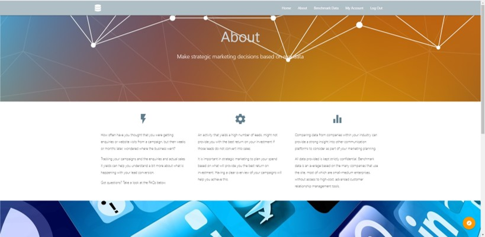 |
| b. As a first-time visitor I want to easily register an account | Sign up is accessible from the navbar, and log in page. The user needs to enter only an email address and password to register an account. | 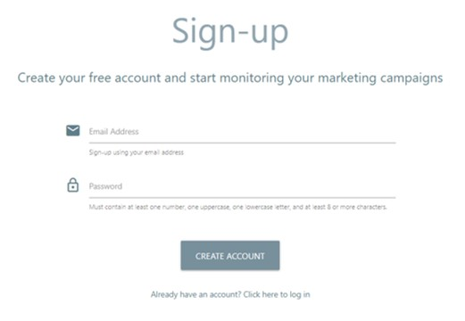  |
| c. As a first-time visitor I want to feel confident that the data I enter is secure | Benchmark data uses collections from existing accounts, but displayed anonymously to ensure company data is not accessible. Campaigns can only be seen by the owning account. |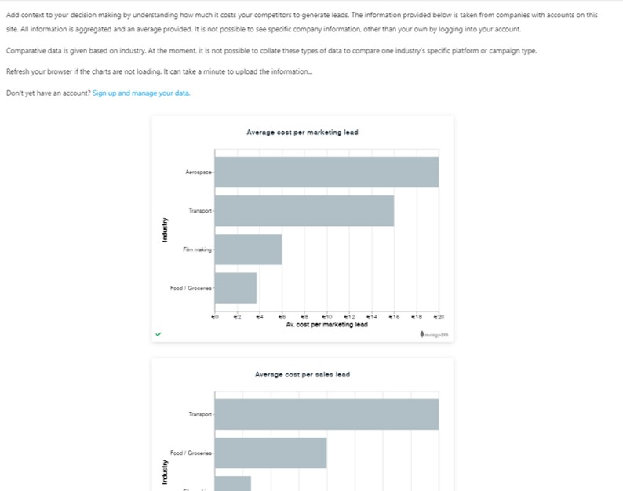  |
| d. As a first-time visitor I want to understand any cost associated with registration | The site is free to use is iterated in the FAQs and site footer. |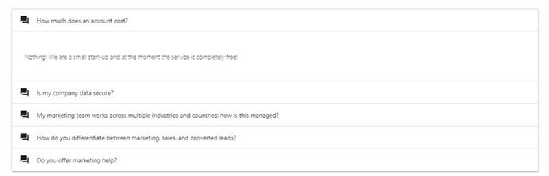 |
| e. As a first-time visitor I want to quickly create a new campaign | Campaigns are created from the Actions menu inside an account. |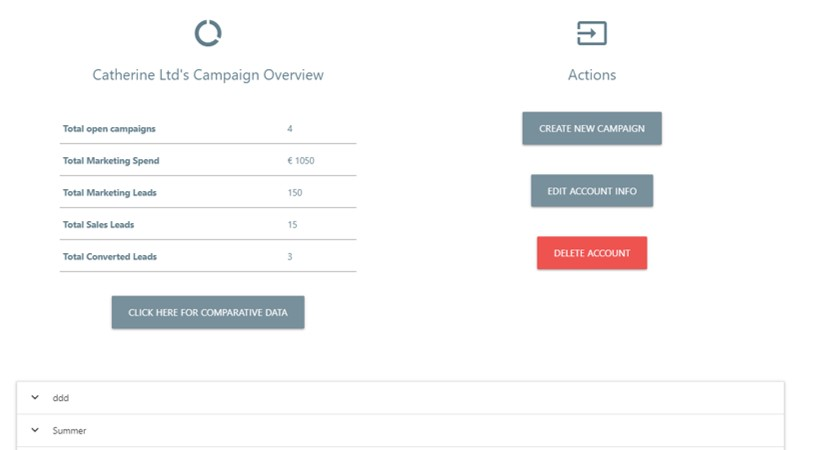  |
| f. As a first-time visitor I want to easily obtain comparative benchmark data | Benchmark links can be found in the navbar, or from the account profile page. |  |

**Returning visitors**

| User story | Requirement met | Image
|---|---|----|
| a. As a returning visitor I want to quickly and easily log into my account profile | Log in links are available the navbar and from the floating action button at the bottom of every page. | 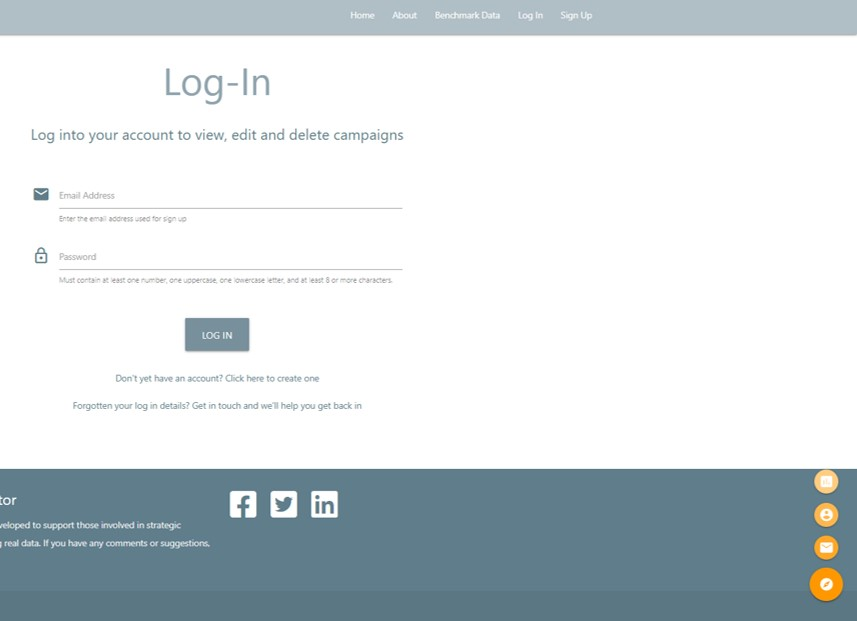  |
| b. As a returning visitor I want to see all open campaigns | All campaigns are listed in the account page, until deleted when they are fully removed. | 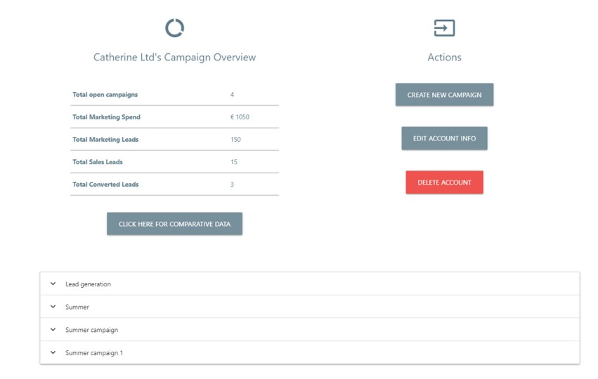  |
| c. As a returning visitor I want to quickly create a new campaign | Campaigns are created from the Actions menu inside an account. |   |
| d. As a returning visitor I want to read existing campaign data | The user clicks the dropdown icon to open information about the individual campaign. | 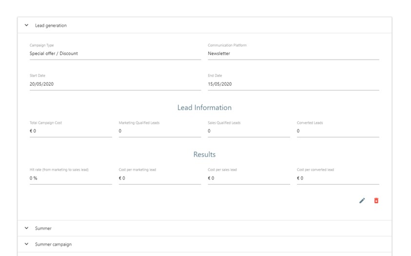  |
| e. As a returning visitor I want to easily update existing campaign and / or the account profile information | User opens the relevant campaign and selects the edit icon to open the campaign and update the information. |   |
| f. As a returning visitor I want to delete campaign information with confidence | User opens the campaign and clicks the delete button: a warning opens with the name of the campaign to be deleted |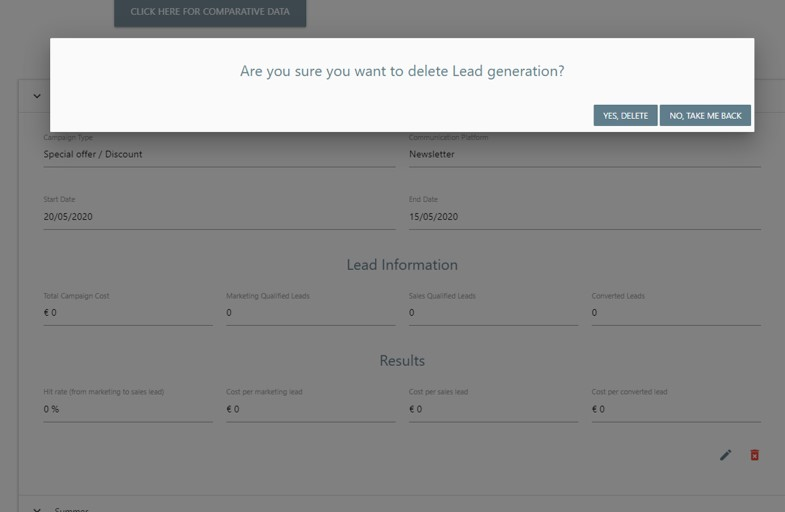  |

**Site administrator**

| User story | Requirement met | Image
|---|---|----|
| a. As a site administrator I want to quickly and easily log into the admin area | Administration logs in from the standard log in page |  |
| b. As a site administrator I want to create a new industry / communications platform / campaign type category | Only Administration can access the Category Management option in top navbar |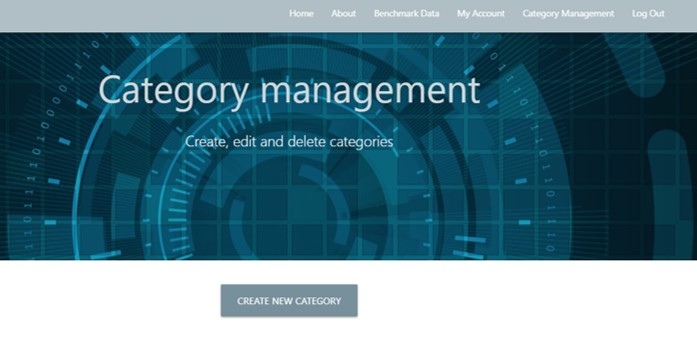  |
| c. As a site administrator I want to read information about existing categories | Category Management provides an overview of all Industries, Campaign types and Communication platform options | 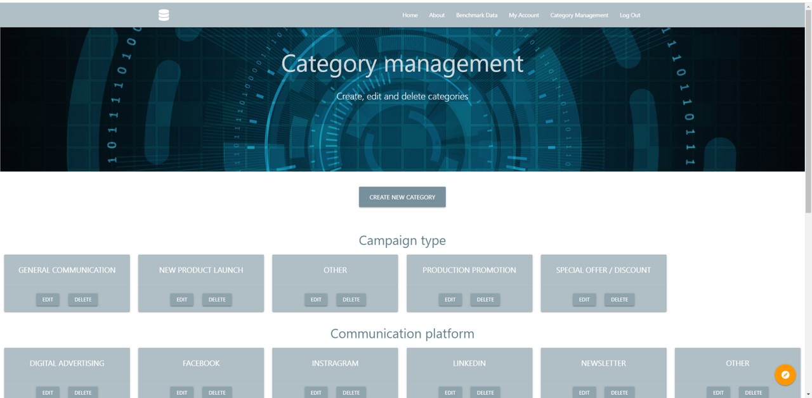  |
| d. As a site administrator I want to easily update existing category information | Edit button available on each category. When Administration update a category option, it is also updated on all campaigns that use that category | 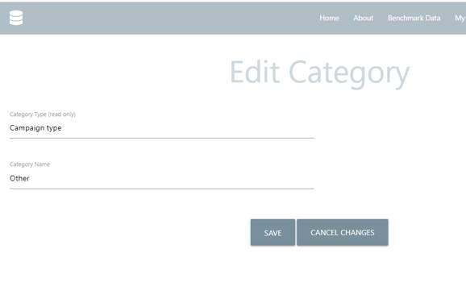  |
| e. As a site administrator I want to delete category information with ease | Simple delete button for each category, accessible by Administration only | 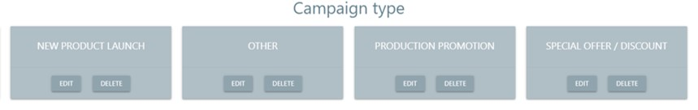  |
| f. As a site administrator I want to create, edit and delete campaigns, the same as a "normal" user | Administration also have the ability to create campaigns |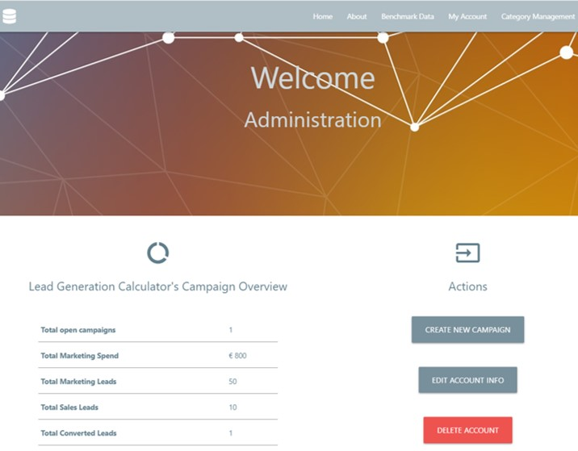  |

## Lighthouse report

## Issues

**[#9](https://github.com/CatherineTrevor/lead-generator-calculator/issues/9)**

Upon creating a campaign, if the user left the calculation fields empty, this created an error. It was necessary to have the calculation created at the same time as the campaign, even without data, therefore a workaround has been to have all fields with 0 and if statements in the python file;

        calc_cost_mql = int(total_campaign_cost / mql) if mql != 0 else 0
        calc_cost_sql = int(total_campaign_cost / sql) if sql != 0 else 0
        calc_cost_per_conversion = int(total_campaign_cost / converted_leads) if converted_leads != 0 else 0
        calc_hit_rate = int(sql / mql * 100) if mql != 0 else 0

The user must enter this information, or leave it as zero for the campaign to be created.

**[#14](https://github.com/CatherineTrevor/lead-generator-calculator/issues/14)**

Initially when a user updated their account information the password was being overwritten, so they were unable to log back in. The hashed password is put into a cookie, so it is no longer overwritten when the user updates account information.

**[#15](https://github.com/CatherineTrevor/lead-generator-calculator/issues/15)**

Materialize appears to cause a problem when reading the selected option in a dropdown, therefore a read only selected information is shown, next to a dropdown should the user want to change this information.

This workaround is used for all relevant dropdown selections.

**[#17](https://github.com/CatherineTrevor/lead-generator-calculator/issues/17)**

Upon a campaign being edited, a new calculation was being created. As the campaign and calculation were being created simultaneously it was possible to connect the calculation to the campaign and vice versa using the id, as neither had been created.

Therefore the user cannot create a campaign with a previously used campaign name, preventing this error from occurring.

**[#18](https://github.com/CatherineTrevor/lead-generator-calculator/issues/18)**

During testing, it was found that dropdowns did not work on a tablet or phone. Following much [research,](https://github.com/Dogfalo/materialize/issues/6464) it would appear this error is linked to Materialize. Materialize has created its own workaround: .browser-default. However this causes another problem where the dropdown options cover the label.

Therefore the label for these dropdowns is actually a span element, styled to look like a label.

            
                Select category type
            

## Code validators

